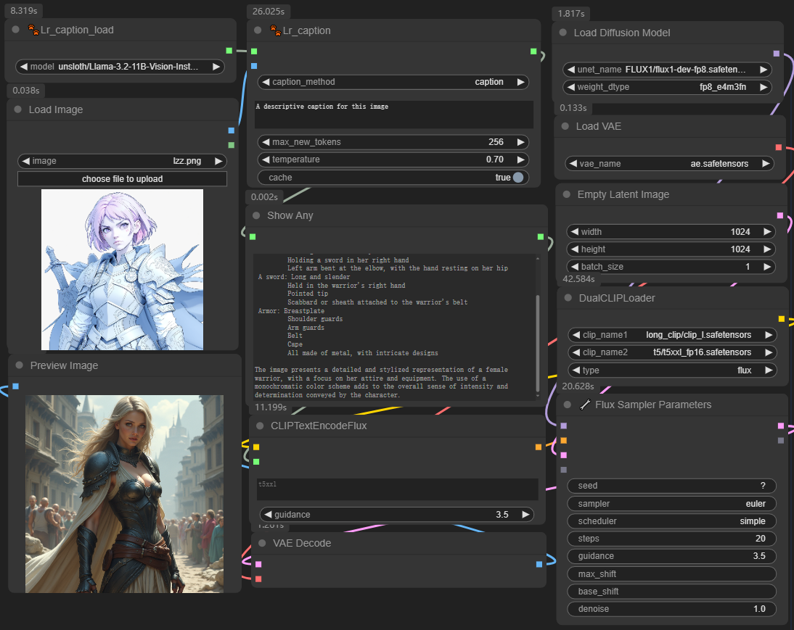

# ComfyUI-Lr_caption
  
  - *基于Llama 3.2-Vision 多模态大语言模型 ( LLMs ) 是预训练和指令调整的图像推理生成模型的集合，大小为 11B 和 90B（文本 + 图像输入/文本输出）。*
  - *Llama 3.2-Vision 指令调整模型针对视觉识别、图像推理、字幕和回答有关图像的一般问题进行了优化。*
  > **注意** transformers >= 4.46.3
  

## Installation
### 安装指南
### 通过下载或克隆仓库安装
1. **下载或克隆仓库**：
   - 将此仓库下载或通过Git克隆到`ComfyUI\custom_nodes\`目录下。

   ```bash
   git clone https://github.com/Auroralr/Lr_caption.git

## Model Download

### 自动下载模型

当运行工作流时，如果`ComfyUI\models\LLM\`目录中未找到模型，模型将自动下载。

### 手动下载模型

如果你需要手动下载`Llama-3.2-11B-Vision-Instruct-bnb-4bit`模型，请按照以下步骤操作：

1. **访问模型下载链接**：
   - 点击链接访问`Llama-3.2-11B-Vision-Instruct-bnb-4bit`:[Llama-3.2-11B-Vision-Instruct-bnb-4bit](https://huggingface.co/unsloth/Llama-3.2-11B-Vision-Instruct-bnb-4bit/tree/main)

   > **提示**：请确保你有有效的网络连接，并且有足够的空间来存储模型文件。

2. **将模型文件放置到指定目录**：
   - 将下载的模型文件复制或移动到`ComfyUI\models\VLLM\`目录下。

   > **重要**：确保模型文件放置在正确的目录中，以便工作流可以正确加载。

4. **验证模型文件**：
   - 在启动工作流之前，检查`ComfyUI\models\VLLM\`目录以确认模型文件已经正确放置。
